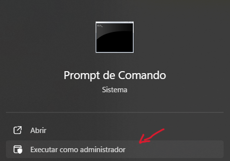
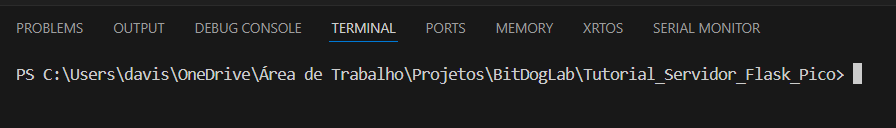
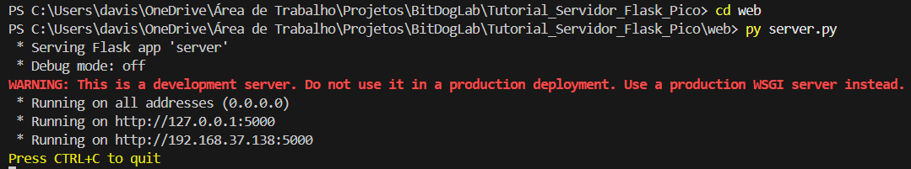
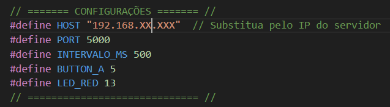
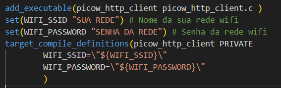
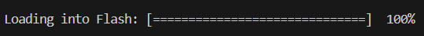

# Tutorial de Comunicação entre RP2040 e Servidor Flask com Socket.IO

## 1. Clonar o Repositório

Antes de tudo, é necessário clonar este repositório em sua máquina. Abra o terminal (CMD, PowerShell ou VSCode) e digite:

```bash
git clone https://github.com/davissontiago/Tutorial_Servidor_Flask_Pico
```
---

## 2. Instalar o Python

Este projeto requer Python instalado na sua máquina. Caso ainda não tenha:

- Baixe o instalador do Python: https://www.python.org/downloads/
- Durante a instalação, marque a opção **"Add Python to PATH"**


---

## 3. Instalar Dependências

Abra o **CMD como administrador** (digite `cmd` no menu Iniciar, clique com o botão direito e selecione "Executar como administrador") e execute:

```bash
pip install flask
pip install flask-socketio
```



---

## 4. Abrir o Terminal no VSCode

Para abrir o terminal integrado no VSCode:

- Pressione `Ctrl + '` (crase)



---

## 5. Executar o Servidor

Com o terminal aberto, entre na pasta `web`:

```bash
cd web
```

E execute o servidor Flask:

```bash
py server.py
```

Após iniciar, você verá uma saída semelhante a:



> Anote o segundo endereço (no exemplo acima, `192.168.37.138`). Esse é o IP que será usado pela placa RP2040 para se comunicar com o servidor e deve ser substituido no arquivo **picow_http_client.c**



> O link para acessar o site é composto pelo ip e a porta 5000. Exemplo: **`http://192.168.37.138:5000`**

---

## 6. Configurar o Wi-Fi no Projeto RP2040

O nome e senha da rede Wi-Fi estão configurados no arquivo **CMakeLists.txt** do projeto C para a RP2040. 

Abra esse arquivo e substitua: "SUA REDE" e "SENHA DA REDE"



Substitua pelos dados corretos da sua rede Wi-Fi (SSID e senha).

 > **Observação:** O computador (local onde o servidor está sendo hospedado) precisa estar na mesma rede wi-fi configurada na RP2040 para ela conseguir se comunicar com o servidor.

---

## 7. Compilar e Enviar Código para a RP2040

Use o VsCode para compilar e enviar o código para a placa RP2040 normalmente.



---

## 8. Como Funciona a Comunicação

- A RP2040 se conecta à rede Wi-Fi e, ao detectar o pressionamento de um botão físico, envia uma requisição HTTP para o servidor Flask.
- O servidor Flask possui uma rota específica (`/CLICK`) que é acionada pela placa.
- Quando essa rota é acessada, o servidor envia um evento WebSocket usando a biblioteca `flask-socketio`.
- O navegador que estiver com a página aberta receberá esse evento e executará a ação correspondente (como mudar a cor de um quadrado de vermelho para verde e mostrar "ON").

Esse fluxo permite que um botão físico da placa RP2040 controle elementos gráficos de uma interface web em tempo real.


---

Se tiver dúvidas ou quiser contribuir, fique à vontade para entrar em contato pelo email: `davissontiagolf@gmail.com` 


#include <stdio.h>
#include "pico/stdlib.h"
#include "pico/cyw43_arch.h"
#include "example_http_client_util.h"

#define WIFI_SSID "BORGES"
#define WIFI_PASSWORD "123456789"

#define HOST "192.168.232.50" // ← Altere aqui para o IP real do seu PC!
#define PORT 5000

#define BUTTON_A 5
#define BUTTON_B 6
#define LED_BLUE 12
#define LED_RED 13

int main() {
    stdio_init_all();

    gpio_init(BUTTON_A); gpio_set_dir(BUTTON_A, GPIO_IN); gpio_pull_up(BUTTON_A);
    gpio_init(BUTTON_B); gpio_set_dir(BUTTON_B, GPIO_IN); gpio_pull_up(BUTTON_B);
    gpio_init(LED_BLUE); gpio_set_dir(LED_BLUE, GPIO_OUT); gpio_put(LED_BLUE, 0);
    gpio_init(LED_RED); gpio_set_dir(LED_RED, GPIO_OUT); gpio_put(LED_RED, 0);

    if (cyw43_arch_init()) {
        printf("Erro ao inicializar Wi-Fi\n");
        return 1;
    }
    cyw43_arch_enable_sta_mode();

    if (cyw43_arch_wifi_connect_timeout_ms(WIFI_SSID, WIFI_PASSWORD, CYW43_AUTH_WPA2_AES_PSK, 30000)) {
        printf("Erro na conexão Wi-Fi\n");
        return 1;
    }

    printf("Conectado ao Wi-Fi. IP: %s\n", ip4addr_ntoa(netif_ip4_addr(netif_list)));

    bool button_a_pressed = false;
    bool button_b_pressed = false;

    while (true) {
        const char* path = NULL;

        bool current_a = !gpio_get(BUTTON_A);
        bool current_b = !gpio_get(BUTTON_B);

        if (current_a && !button_a_pressed) {
            path = "/CLICK";
            gpio_put(LED_BLUE, 1);
            button_a_pressed = true;
        } else if (!current_a && button_a_pressed) {
            path = "/SOLTO";
            gpio_put(LED_BLUE, 0);
            button_a_pressed = false;
        }

        if (current_b && !button_b_pressed) {
            path = "/RED_ON";
            gpio_put(LED_RED, 1);
            button_b_pressed = true;
        } else if (!current_b && button_b_pressed) {
            path = "/RED_OFF";
            gpio_put(LED_RED, 0);
            button_b_pressed = false;
        }

        if (path != NULL) {
            printf("Enviando comando para %s\n", path);

            EXAMPLE_HTTP_REQUEST_T req = {0};
            req.hostname = HOST;
            req.url = path;
            req.port = PORT;
            req.headers_fn = http_client_header_print_fn;
            req.recv_fn = http_client_receive_print_fn;

            int result = http_client_request_sync(cyw43_arch_async_context(), &req);
            if (result != 0) {
                printf("Erro ao enviar comando: %d\n", result);
            } else {
                printf("Comando enviado com sucesso!\n");
            }
            sleep_ms(100);
        }

        sleep_ms(50);
    }
}
